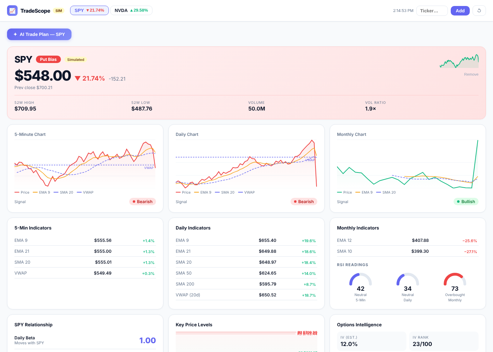

# TradeScope

A single-page dashboard for sizing up a stock for an intraday options trade,
with every reading shown relative to SPY. React, Recharts and Vite.



## What it shows

For each ticker you add:

- **Three timeframes** (5-minute, daily, monthly): price with EMA 9 and SMA 20
  overlays, VWAP, and a bullish / bearish / mixed signal per timeframe.
- **Indicators**: EMA 9/21, SMA 20/50/200, VWAP and RSI, each with its distance
  from the current price.
- **SPY relationship**: daily beta, daily and intraday correlation, and the
  move SPY's day implies for the ticker.
- **Key levels**: three support and three resistance levels from the last
  20 sessions.
- **Options context**: estimated volatility, expected 1-day and 7-day moves,
  and nearby strikes.
- **Setup summary**: a call / put / neutral bias from the three timeframe signals.

## Run it

Requires Node.js 18+.

```bash
npm install
npm run dev
```

With no configuration the app runs on **simulated data**, generated
deterministically per ticker, so the interface works without an account. The
prices in the screenshot are simulated.

### Live data

Copy `.env.example` to `.env` and add a free [Finnhub](https://finnhub.io) key:

```
VITE_FINNHUB_KEY=your_key_here
```

The app then loads quotes, candles and company profiles from Finnhub and
refreshes every 60 seconds. The key is read in the browser, so keep this to
local or private use.

## Known limitations

- Implied volatility is estimated from recent daily ranges, not taken from an
  options chain, so IV and IV rank are approximations.
- The "AI Trade Plan" button calls the Anthropic API directly from the browser
  with no key. It worked inside the sandbox where this was first built and
  fails gracefully elsewhere; it needs a small server-side proxy to work here.
- Finnhub's free tier may not return intraday candles for every symbol.

## Project structure

```
src/App.jsx     Data loading, indicator math, analysis and all components
src/main.jsx    React entry point
index.html      Vite entry
```

Educational project. Not financial advice.
